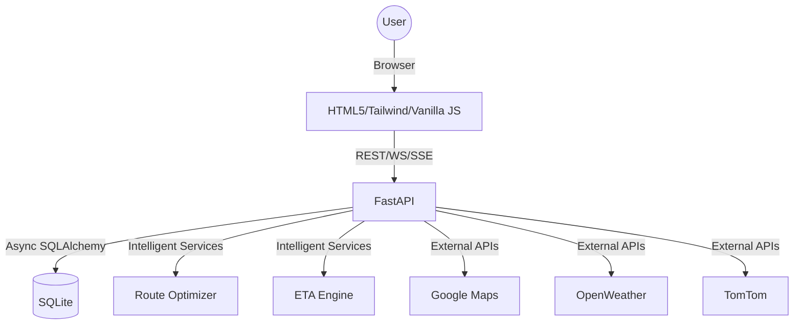

# Tracksy — AI-Powered Intelligent Logistics Optimization System

Tracksy is a production-grade, full-stack logistics SaaS designed to optimize multimodal global supply chains. It features a multimodal route optimizer, AI-driven ETA predictions, real-time fleet tracking, and automated disruption management.

## Quick Start (macOS M4 Pro)

```bash
cd Tracksy2.0
python3 -m venv .venv
source .venv/bin/activate
pip install -r requirements.txt
cp .env.example .env       # optionally add API keys
python run.py
```

Open [http://localhost:8000](http://localhost:8000) — database is seeded automatically on first run.

## Demo Credentials

| Role | Email | Password |
| :--- | :--- | :--- |
| **Admin** | admin@tracksy.io | tracksy2024 |
| **Supplier** | supplier@demo.com | tracksy2024 |
| **Customer** | customer@demo.com | tracksy2024 |
| **Driver** | driver@demo.com | tracksy2024 |

## Feature Tour

1.  **Admin Dashboard**: Real-time fleet map with animated markers, KPI cards with count-up animations, and a "Simulate Disruption" engine.
2.  **Multimodal Routing**: AI-optimized routes across Road, Air, Sea, and Rail with cost-vs-speed tradeoffs.
3.  **Real-Time Tracking**: SSE and WebSocket-powered live position updates and status changes.
4.  **Self-Learning ETA**: A regression-based ETA engine that improves accuracy over time using historical data.
5.  **Carbon Footprint**: Automated CO2 calculation per mode with eco-friendly route suggestions.
6.  **Collaborative Logistics**: Smart capacity sharing alerts to optimize unused truck space.

## Architecture



## Folder Structure

```text
Tracksy2.0/
├── app/
│   ├── routers/       # REST API Endpoints
│   ├── services/      # AI & Logic Services
│   ├── static/        # CSS, JS, Assets
│   └── templates/     # HTML5 Portals (Jinja2)
├── run.py             # Entry Point
├── requirements.txt   # Dependencies
└── tracksy.db         # Auto-generated SQLite
```
